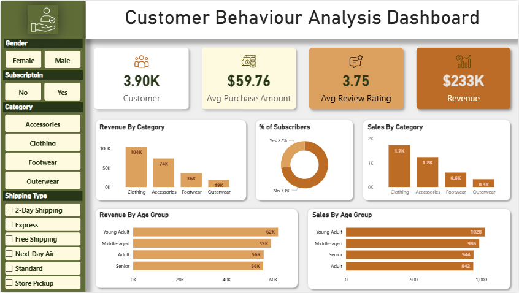

# Customer Behaviour Analysis – Data Analytics Project

## 📌 Overview
This project analyzes customer purchasing behavior using Python, SQL, and Power BI.  
The workflow includes loading a retail dataset, performing Exploratory Data Analysis (EDA), cleaning and transforming the data, running SQL queries on PostgreSQL/MySQL/SQL Server, and finally building an interactive Power BI dashboard.

The project demonstrates:
- Data preprocessing & cleaning  
- Exploratory Data Analysis (EDA)  
- SQL-based business analysis  
- Dashboard creation in Power BI  
- End-to-end data analytics workflow  

---

## 📂 Dataset
The dataset includes customer demographics, product categories, purchase amounts, shipping preferences, review ratings, and revenue details.

**Sample Columns**
- `CustomerID`  
- `Gender`  
- `AgeGroup`  
- `ProductCategory`  
- `PurchaseAmount`  
- `Subscription`  
- `ShippingType`  
- `ReviewRating`  
- `Revenue`

*(Add the dataset link or upload location if available.)*

---

## 🛠 Tools & Technologies
- **Python**: Pandas, NumPy, Matplotlib, Seaborn  
- **Databases**: PostgreSQL / MySQL / SQL Server  
- **SQLAlchemy** for DB connectivity  
- **Power BI** for visualization  
- **Jupyter Notebook / VS Code**  
- **Git & GitHub**

---

## 📘 Project Workflow

### **1. Data Loading (Python)**
- Import the dataset using Pandas  
- Inspect data shape, types, and missing values  
- Generate summary statistics  

### **2. Exploratory Data Analysis (EDA)**
- Analyze the distribution of customer purchase amounts  
- Category-level revenue analysis  
- Age group and gender segmentation  
- Visual exploration with Matplotlib/Seaborn  

### **3. Data Cleaning & Preprocessing**
- Handle missing data  
- Remove duplicates  
- Convert datatypes  
- Feature engineering (age groups, revenue metrics, etc.)  

### **4. SQL Analysis**
The cleaned dataset is loaded into SQL (PostgreSQL/MySQL/SQL Server).  
Example analyses include:
- Revenue by product category  
- Top purchasing customers  
- Subscription vs non-subscription metrics  
- Shipping type performance  
- Age group behavior segmentation  

SQL queries help validate patterns observed in Python.

### **5. Power BI Dashboard**
An interactive dashboard was created to visualize key business KPIs, such as:
- Total Customers  
- Average Purchase Amount  
- Average Review Rating  
- Total Revenue  
- Revenue by Category  
- Sales by Age Group  
- Subscriber distribution  
- Filters: Gender, Subscription, Category, Shipping Type  

---

## 📊 Dashboard Preview

Below is the Power BI dashboard created for visualizing customer behavior insights:

  

---

## 📈 Key Results & Insights
- Clothing and Accessories are the highest-performing product categories.  
- Young Adults contribute the largest share of total purchases.  
- Subscribers consistently spend more than non-subscribers.  
- Free Shipping and 2-Day Shipping are the most preferred options.  
- The average purchase amount is around **$59–$60**, with an average review rating of **3.75**.

